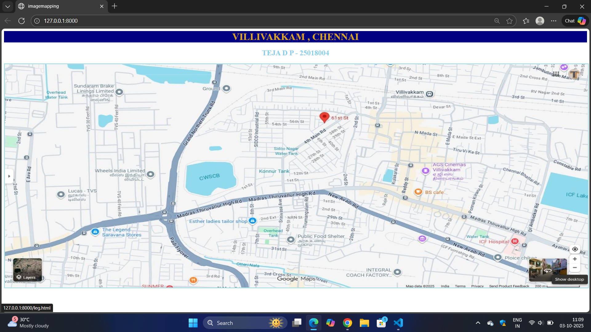
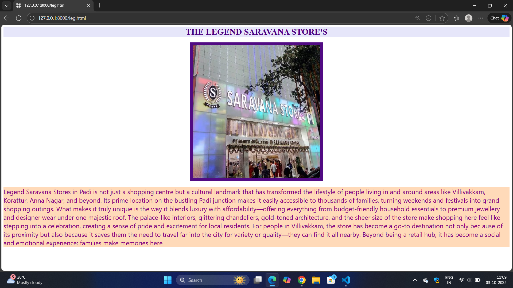
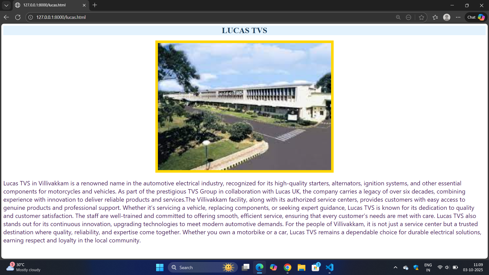
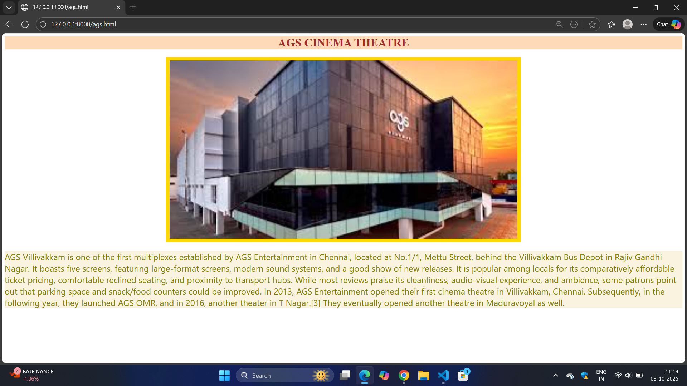
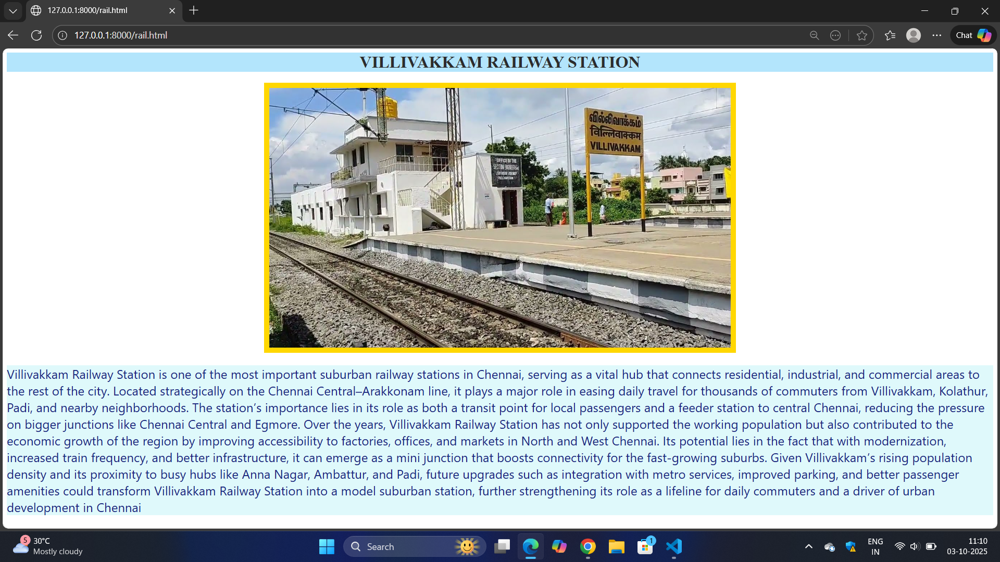
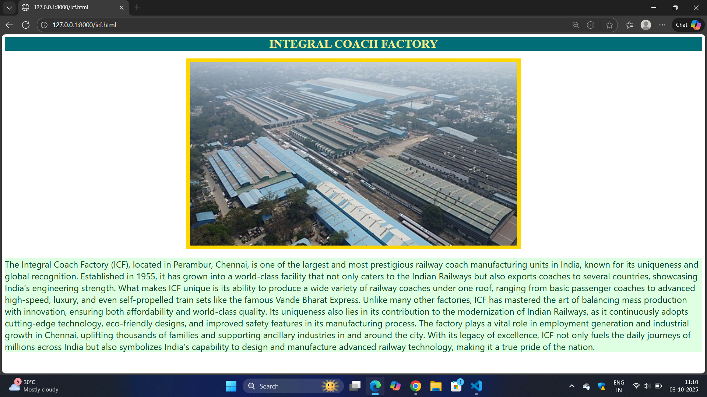

# Ex04 Places Around Me
# Date:03.10.2025
# AIM
To develop a website to display details about the places around my house.

# DESIGN STEPS
## STEP 1
Create a Django admin interface.

## STEP 2
Download your city map from Google.

## STEP 3
Using <map> tag name the map.

## STEP 4
Create clickable regions in the image using <area> tag.

## STEP 5
Write HTML programs for all the regions identified.

## STEP 6
Execute the programs and publish them.

# CODE
```
main.html

<html>
    <head>
        <title> imagemapping</title>
    </head>
    <style>
        h1{ text-align: center; -webkit-text-fill-color:goldenrod; background-color: navy;}
        h2{ text-align: center; -webkit-text-fill-color:skyblue}
        img{ border:3px solid powderblue;}
    </style>
    <body>
        <h1> VILLIVAKKAM , CHENNAI </h1>
        <h2> TEJA D P - 25018004</h2>
        
        <map name="#imgmap">
        <area shape="rect" coords="430,540,115,550" alt="Ractangle" href="leg.html">
        <area shape="rect" coords="360,425,67,434" alt="Ractangle" href="lucas.html">
        <area shape="rect" coords="1286,263,1293,331" title="Ractangle" href="ags.html">
         <area shape="rect" coords="1277,79,1038,87" alt="Ractangle" href="rail.html">
        <area shape="rect" coords="1196,683,873,686" alt="Ractangle" href="icf.html">
        </map>
    </body>
</html>
 leg.html
 
<html>
    <head></head>
    <style>
        h1{text-align: center; background-color: #e6e6fa; -webkit-text-fill-color: #4b0082;}
       
        p{ background-color:peachpuff; -webkit-text-fill-color: purple; font-family: 'Segoe UI', Tahoma, Geneva, Verdana, sans-serif;
            font-size: x-large}
    </style>
    <body>
    <h1> THE LEGEND SARAVANA STORE'S </h1> 
    <div class="image">
    
    </div>
    <p>
        Legend Saravana Stores in Padi is not just a shopping centre but a cultural
         landmark that has transformed the lifestyle of people living in and around areas like Villivakkam, Korattur, Anna Nagar, and beyond. Its prime location on the bustling Padi junction makes it easily accessible to thousands of families, turning weekends and festivals into grand shopping outings. What makes it truly unique is the way it blends luxury with affordability—offering everything from budget-friendly household essentials to premium jewellery and designer wear under one majestic roof. The palace-like interiors, glittering chandeliers, gold-toned architecture, and the sheer size of the store make shopping here feel like stepping into a celebration, creating a sense of pride and excitement for local residents. For people in Villivakkam, the store has become a go-to destination not only bec
        ause of its proximity but also because it saves them the 
        need to travel far into the city for variety or quality—they can find it all 
        nearby. Beyond being a retail hub, it has become a social and emotional experience: families
         make memories here
    </p>

    </body>
</html>
lucas.html

<html>
    <head></head>
    <style>
        h1{text-align: center; background-color: #e3f2fd; -webkit-text-fill-color: #1e3d59;}
       
        p{ background: color #f3e5f5;; -webkit-text-fill-color: #4a235a; font-family: 'Segoe UI', Tahoma, Geneva, Verdana, sans-serif;
            font-size: x-large}
    </style>
    <body>
    <h1> LUCAS TVS</h1> 
    <div class="image">
    
    </div>
    <p>
        Lucas TVS in Villivakkam is a renowned name in the automotive electrical industry, recognized for its high-quality starters, alternators, ignition systems, and other
         essential components for motorcycles and vehicles. As part of the prestigious TVS Group in collaboration with Lucas UK, the company carries a legacy of over six decades,
          combining experience with innovation to deliver reliable products and services.The Villivakkam facility, along with its authorized service centers, provides customers with
           easy access to genuine products and professional support. Whether it’s servicing a vehicle, replacing components, or seeking expert guidance, Lucas TVS is known for its dedication 
           to quality and customer satisfaction. The staff are well-trained and committed to offering smooth, efficient service, ensuring that every customer’s needs are met with care.
       Lucas TVS also stands out for its continuous innovation, upgrading technologies to meet modern automotive demands. For the people of Villivakkam, it is not just a service center but a
     trusted destination where quality, reliability, and expertise come together. Whether you own a motorbike or a car, Lucas TVS remains a dependable choice for durable electrical solutions, 
     earning respect and loyalty in the local community.
    </p>

    </body>
</html>
ags.html

<html>
    <head></head>
    <style>
        h1{text-align: center; background-color:peachpuff; -webkit-text-fill-color:brown;}
       
        p{ background-color:#faf3e0; -webkit-text-fill-color:olive; font-family: 'Segoe UI', Tahoma, Geneva, Verdana, sans-serif;
            font-size: x-large}
    </style>
    <body>
    <h1> AGS CINEMA THEATRE</h1> 
    
    

    <p>
        AGS Villivakkam is one of the first multiplexes established by AGS Entertainment in Chennai, located at No.1/1, Mettu Street, behind the Villivakkam Bus Depot in Rajiv Gandhi Nagar. 
 It boasts five screens, featuring large-format screens, modern sound systems, and a good show of new releases. 
 It is popular among locals for its comparatively affordable ticket pricing, comfortable reclined seating, and proximity to transport hubs. 
 While most reviews praise its cleanliness, audio-visual experience, and ambience, some patrons point out that parking space and snack/food counters could be improved.  In 2013, AGS Entertainment opened their first cinema theatre in Villivakkam, Chennai. Subsequently, in the following year, they launched AGS OMR, and in 2016, another theater in T Nagar.[3] They eventually opened another theatre in Maduravoyal as well.
    </p>

    </body>
</html>
rail.html

<html>
    <head></head>
    <style>
        h1{text-align: center; background-color: #b3e5fc; -webkit-text-fill-color: #2c2c2c;}
       
        p{ background-color:#dff9fb; -webkit-text-fill-color: #1a237e; font-family: 'Segoe UI', Tahoma, Geneva, Verdana, sans-serif;
            font-size: x-large}
    </style>
    <body>
    <h1> VILLIVAKKAM RAILWAY STATION  </h1> 
   
    
    
    <p>
       Villivakkam Railway Station is one of the most important suburban railway stations in Chennai, serving as a vital hub that connects residential, 
       industrial, and commercial areas to the rest of the city. Located strategically on the Chennai Central–Arakkonam line, it plays a major role in 
       easing daily travel for thousands of commuters from Villivakkam, Kolathur, Padi, and nearby neighborhoods. The station’s importance lies in its role
        as both a transit point for local passengers and a feeder station to central Chennai, reducing the pressure on bigger junctions like Chennai Central 
        and Egmore. Over the years, Villivakkam Railway Station has not only supported the working population but also contributed to the economic growth of 
        the region by improving accessibility to factories, offices, and markets in North and West Chennai. Its potential lies in the fact that with modernization, 
        increased train frequency, and better infrastructure, it can emerge as a mini junction that boosts connectivity for the fast-growing suburbs. Given Villivakkam’s
         rising population density and its proximity to busy hubs like Anna Nagar, Ambattur, and Padi, future upgrades such as integration with metro services, improved parking,
          and better passenger amenities could transform Villivakkam Railway Station into a model suburban station, further strengthening its role as a lifeline for daily commuters and 
          a driver of urban development in Chennai
    </p>

    </body>
</html>
 icf.html
 
<html>
    <head></head>
    <style>
        h1{text-align: center; background-color:#006d77; -webkit-text-fill-color:#f8ed89;}
       
        p{ background-color:#dfffe2; -webkit-text-fill-color:#064420; font-family: 'Segoe UI', Tahoma, Geneva, Verdana, sans-serif;
            font-size: x-large}
    </style>
    <body>
    <h1> INTEGRAL COACH FACTORY </h1> 

    
    <p>
        The Integral Coach Factory (ICF), located in Perambur, Chennai, is one of the largest and most prestigious railway coach manufacturing units in India, known for its uniqueness and global recognition. Established in 1955, it has grown into a world-class facility that not only caters to the Indian Railways but also exports coaches to several countries, showcasing India’s engineering strength. What makes ICF unique is its ability to produce a wide variety of railway coaches under one roof, ranging from basic passenger coaches to advanced high-speed, luxury, and even self-propelled train sets like the famous Vande Bharat Express. Unlike many other factories, ICF has mastered the art of balancing mass production with innovation,
         ensuring both affordability and world-class quality. Its uniqueness also lies
          in its contribution to the modernization of Indian Railways, as it continuously
           adopts cutting-edge technology, eco-friendly designs, and improved safety 
           features in its manufacturing process. The factory plays a vital role in
            employment generation and industrial growth in Chennai, uplifting thousands of families and supporting ancillary industries in and around the city. With its legacy of excellence, ICF not only fuels the daily journeys of millions across India but also symbolizes India’s capability to design and manufacture advanced railway technology, making it a true pride of the nation.
    </p>

    </body>
</html>
```
# OUTPUT







# RESULT
The program for implementing image maps using HTML is executed successfully.
